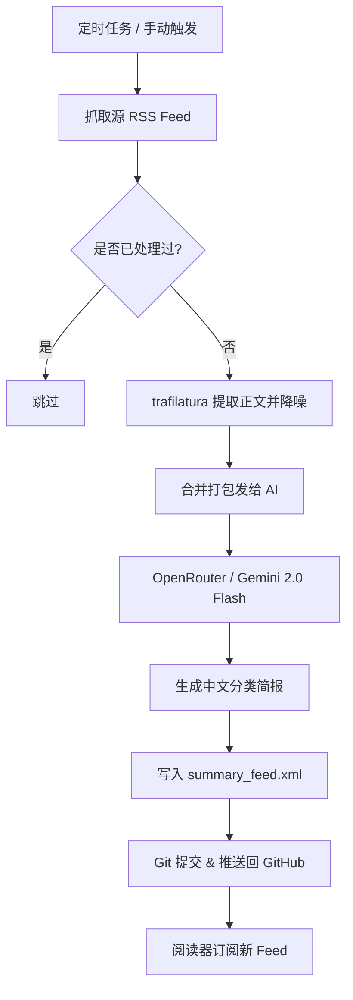

# 🤖 SummaRSS - RSS AI Daily Summarizer

这是一个基于 **GitHub Actions + OpenRouter (Gemini)** 的自动化 RSS 摘要生成器。它监控指定的 RSS 订阅源，通过智能正文提取工具获取最新文章全文，利用 AI 模型将多条新闻合并为一份精炼的中文每日简报，并自动发布为兼容 RSS 2.0 规范的全新订阅源，供 Reeder、NetNewsWire 等现代阅读器无缝订阅。



---

## ✨ 核心特性

*   **⚡ 零服务器成本 (Serverless)**: 采用 **Git-as-DB** 架构，完全托管在 GitHub Actions 与 GitHub Pages/Raw 上，无需维护昂贵的服务器与数据库。
*   **🔄 增量更新与防重**: 使用 `processed.txt` 精确跟踪已读条目，每次只增量抓取和分析最新发布的文章，节约 API 额度和运行开销。
*   **🧼 智能网页降噪**: 引入 `trafilatura` 库对原文 HTML 进行结构分析，自动剥离侧边栏、广告、导航栏等杂质，只提取纯净正文用于 AI 分析。
*   **🤖 高质量合并摘要**: 采用高效的批量处理 Prompt，将多篇新文章聚合分类并用结构化 Markdown（转化为阅读器兼容的 HTML）输出，拒绝废话，直击事实。
*   **📦 严苛的工程纪律**: 极简主义设计，除正文提取外均使用 Python 标准库（如 `xml.etree` 替代 `feedparser`），且配备重试与费用熔断保护机制。

---

## 🚀 快速开始

### 方案 A：GitHub Actions 自动化部署 (推荐)

#### 1. Fork 并克隆本仓库
首先将本仓库 Fork 到你自己的 GitHub 账号下。

#### 2. 开启 Actions 写入权限 (重要 ⚠️)
为了让 GitHub Actions 能够将生成的 RSS 文件和处理状态推回你的仓库，必须进行以下配置：
1. 进入你的仓库设置：`Settings -> Actions -> General`。
2. 滚动到页面底部找到 **Workflow permissions**。
3. 选择 **Read and write permissions** 并保存。

> [!WARNING]
> 如果不开启此权限，运行 Actions 时会出现 `Permission to ... denied to github-actions[bot]` 报错。

#### 3. 配置 Repository Secrets
进入 `Settings -> Secrets and variables -> Actions`，点击 `New repository secret` 添加以下机密：

| 变量名 | 类型 | 是否必填 | 说明 | 示例值 |
| :--- | :--- | :--- | :--- | :--- |
| `OPENROUTER_API_KEY` | Secret | **是** | OpenRouter API 密钥 | `sk-or-v1-xxxx...` |
| `RSS_SOURCE` | Secret | 否 | 你要监控的 RSS 源地址 | `https://9to5mac.com/feed/` |
| `AI_MODEL` | Secret | 否 | 使用的 AI 模型（默认为 Gemini 2.0 Flash） | `google/gemini-2.0-flash-001` |

#### 4. 激活订阅
*   GitHub Actions 默认配置为**每天北京时间 07:35 运行**（23:35 UTC）。
*   你也可以在 **Actions** 选项卡中手动触发 `RSS AI Summary` 工作流。
*   成功运行后，你可以在以下 Raw 地址直接订阅你的个人 AI 简报源：
    ```text
    https://raw.githubusercontent.com/{你的用户名}/{你的仓库名}/main/summary_feed.xml
    ```

---

### 方案 B：本地开发与调试

如果你希望在本地测试或直接在本地运行此脚本，请按如下步骤操作：

#### 1. 安装依赖
```bash
pip install -r requirements.txt
```

#### 2. 设置环境变量并运行
在命令行中导出所需的配置并运行脚本：
```bash
export OPENROUTER_API_KEY="your_openrouter_api_key"
export RSS_SOURCE="https://9to5mac.com/feed/" # 也可以是本地 XML 路径
export AI_MODEL="google/gemini-2.0-flash-001"

python3 summarize.py
```

---

## 🛠 技术细节与优化

*   **多模型兼容**: 基于 OpenRouter 接口，你也可以将 `AI_MODEL` 切换为其他大语言模型（如 `anthropic/claude-3.5-sonnet` 或 `deepseek/deepseek-chat`）。
*   **网络鲁棒性**: 对 OpenRouter 接口调用内置了 **3 次指数退避重试** 机制，应对突发性的网络波动。
*   **费用熔断机制**: 每次最多只抓取并处理前 `30` 篇最新文章 (`MAX_ITEMS`)，避免在 RSS 源突发成百上千条更新时产生意外的 Token 账单。
*   **历史留存机制**: 摘要 RSS 源最大保留最近的 `400` 条历史快照，随着时间推移自动剔除古老条目，保持 XML 轻量化。
*   **标准规范兼容**: 自动添加符合规范的 `atom:link`，并采用 RFC 822 规范的时间格式，完美通过各类 RSS 阅读器和校验工具的严格验证。

---

## ⚖️ License

[MIT](LICENSE)